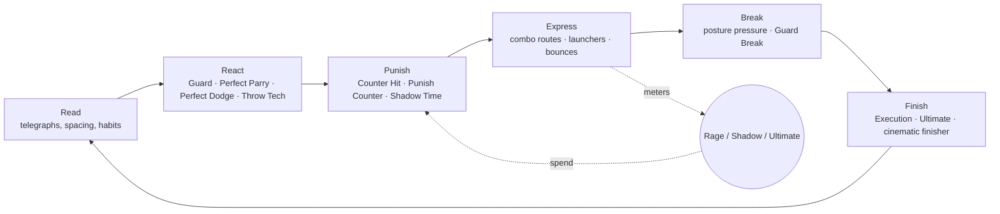
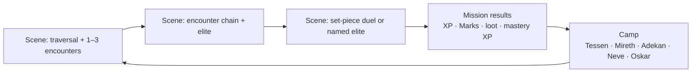
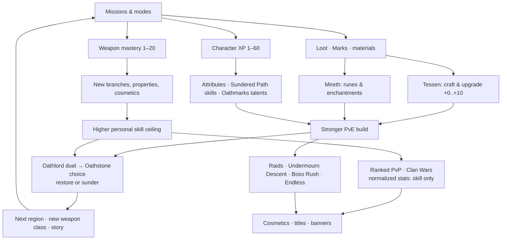

# OATHSUNDER — Game Design Overview

> **Document:** GDD 02-00 · **Owner:** Lead Systems Design · **Status:** Phase 2 design baseline
> **Canon:** Every name, ID, button and mechanic in this chapter follows `00-Canon.md`. Frame-level
> numbers in the combat code and move data (JSON) are authoritative; numbers written here are design
> targets that the data must meet or that tuning must revisit here first.

*Every oath has a shadow.*

---

## 1. The game in one paragraph

OATHSUNDER is a 2.5D cinematic action fighting RPG. The player is **Rhen**, a former Oathwarden
executed for refusing to tithe a living child's shadow, who returns from **the Undermourn**
"Oathsundered": bound by no oath and able to wield **Ember** and **Umbra** together. With his severed
shadow **Sable** as voice, partner and possible rival, Rhen crosses the twelve regions of **Varanth**,
defeats the twelve **Oathlords**, and decides for each **Oathstone** whether to restore or sunder it.
Each fight is a frame-honest duel on a 60 Hz deterministic simulation, and each duel is staged like
a film: hitstop, paired Executions, cinematic Ultimates, and slow-motion finishers. Around the duels
sits a full RPG layer (levels 1–60, attributes, skill and talent trees, loot, runes, crafting,
thirteen weapon classes with mastery tracks) that never touches ranked PvP, where every fighter uses
normalized stats.

---

## 2. Design pillars

Every feature pitch, tuning pass and store item is checked against these five pillars. If a
proposal breaks a "we will not" line, it is cut or redesigned. A deadline is not a reason to ship it.

### Pillar 1 — Every Strike Is a Promise (honest, readable, skill-first combat)

The fight is a conversation both fighters can read. Every attack shows a telegraph, has a punish
window, and behaves the same way every time.

| We will | We will not |
|---|---|
| Run all combat on a 60 tick/s fixed-point deterministic simulation with an 8-frame input buffer | Let render frame rate, device speed or network jitter change combat outcomes |
| Give every attack a readable telegraph (unblockable, low, overhead, grab colors + glyphs + audio) | Hide unblockables or mixups behind VFX clutter, off-screen spawns or camera cuts |
| Publish frame data in Training for every move of every class | Ship "secret" properties that Training does not show |
| Make enemy AI react only to what a human could see | Let the AI read buffered inputs, or give it reactions faster than its difficulty's reaction floor (08-Enemies §3.2, §8) |
| Keep random numbers out of PvP completely | Ship crits, random procs or random damage variance in ranked or casual PvP |

### Pillar 2 — Two Souls, One Blade (Ember and Umbra)

Rhen is the only being who holds both life-force and shadow-force. That duality shapes the meters,
the build choices and the endings.

| We will | We will not |
|---|---|
| Build the combat economy on three meters: Rage (Ember), Shadow (Umbra), Ultimate (Oath-light) | Add a fourth combat resource that dilutes the Ember/Umbra identity |
| Make **Ember Rage** and **Umbral Shadow** two exclusive modes. Choosing which to spend, and when, is a core decision, and Sable fights beside Rhen in Shadow | Make one meter strictly better than the other for any class |
| Mirror narrative choices (restore/sunder Oathstones) with reward flavor and small, symmetric PvE effects (the Oath balance bands give at most +10% meter gain, 02-World-and-Narrative §6.2) | Lock any combat mechanic behind choosing a "good" or "evil" path, or let story choices affect PvP |
| Give Sable a reactive voice that calls reads, teaches and taunts | Let companion chatter cover telegraph audio cues. Combat VO is ducked under telegraph stingers |

### Pillar 3 — Cinema at the Speed of Play

Every duel should look like a fight scene without ever feeling like a cutscene.

| We will | We will not |
|---|---|
| Stage Executions, Ultimates and round-ending finishers as paired cinematic animations | Take control away for more than 7 s in gameplay (Ultimate cinematic cap), or 3 s for a PvP finisher |
| Use hitstop, camera punch, haptics and layered audio on every contact (01-Combat §10) | Add screen shake the player cannot reduce (camera shake slider 0–100%) |
| Let every story cutscene be skipped after it has been seen once, and paused at any time | Put unskippable cinematics in front of a repeated boss attempt |
| Give every class a signature silhouette, trail and sound | Reuse another class's Ultimate or Execution animation as a cost-saving measure |

### Pillar 4 — Thirteen Paths to Mastery

Each weapon class plays like a full fighting-game character. Rhen changes weapons and becomes a
different fighter.

| We will | We will not |
|---|---|
| Ship 13 classes (15 movesets: Arcane has Grimoire, Warfan and Soul Lantern sub-forms), each with Light tree, Heavy tree, Air combo, Charged attack, Specials, Ultimate and Execution | Ship "reskin" classes that share a combo tree |
| Make mastery teach a class step by step: branches, properties, cosmetics | Let mastery add more than +5% raw stats (PvE only). Mastery is disabled in ranked, where every player gets the full kit |
| Offer a **Veteran Start** option that unlocks every move of every owned class for fighting-game experts | Force experienced players through gating they don't need |
| Balance classes on matchup charts and pick/win data every season | Sell a class, a move or a stance |

### Pillar 5 — Fair by Design

Players respect the game when the game respects them: their time, their money, their device and
their body.

| We will | We will not |
|---|---|
| Sell the campaign as a premium product and only cosmetics in the store | Sell power, XP boosts, materials, loot chances, revives or stamina |
| Design every mode so it can be played in 3–5 minute sessions on mobile | Use energy timers, wait timers, or streaks that punish players for missing a day |
| Provide Classic and Simplified control schemes, both ranked-legal with no damage penalty | Put a skill ceiling behind physical dexterity when an equivalent input exists |
| Ship full accessibility: remapping, color-blind telegraph palettes, haptic/audio telegraphs, game-speed assist in PvE | Ship loot boxes bought with paid currency, or offers that target minors |

---

## 3. Player fantasy

> *"I am the oath-breaker who walked back out of death. My shadow walks beside me and argues with
> me. Every blade in Varanth has a style, and I can learn all of them. The people who built this
> empire on stolen souls are going to face me one at a time, in duels they cannot cheat. When I
> win, I decide what their oaths were worth."*

The fantasy has four layers, and each system serves at least one:

| Layer | Player feeling | Delivered by |
|---|---|---|
| **The Duelist** | "I read them and punished them." | Perfect Parry, Perfect Dodge + Shadow Time, frame-honest punishes, telegraphs |
| **The Oathsundered** | "I hold life and death in my hands." | Ember Rage, Umbral Shadow, Sable's echoes, dual-element builds |
| **The Master of Thirteen Blades** | "I can become any fighter." | 13 weapon classes, mastery tracks, signature combos, Oathlord signature weapons |
| **The Judge of Oaths** | "My choices reshape the world." | Restore/sunder each Oathstone, four endings, companions' fates |

---

## 4. Core loop and meta loop

### 4.1 Moment-to-moment loop (5–30 seconds): the duel

### 4.2 Mission loop (3–15 minutes)

A **story mission** is made of 1–4 **Scenes**. Each Scene is 3–5 minutes of play with a checkpoint
at its start. Duels and Trials are usually one or two Scenes, and Gauntlets, Escort-Duels and Survival Waves
two to four (mission types: 03-Missions §0.1). The average mission is about 12 minutes. The 10th mission of each region
is the Oathlord duel: three phases, about 8–12 minutes.

### 4.3 Meta loop (hours to weeks)

**Loop contracts**

1. Each mission pays out at least one of: character XP, weapon mastery XP, gear, or a story beat. Most pay all four.
2. PvE power (gear, attributes, talents) speeds up the campaign and endgame. It never enters ranked PvP.
3. Skill carries into every mode. Mastery teaches moves that work the same in PvE, Training and PvP.
4. Cosmetics are the long-term chase and the only thing sold.

---

## 5. Session design

### 5.1 Mobile (target session: 3–5 minutes)

| Rule | Implementation |
|---|---|
| Every mode offers a unit of play of 5 minutes or less | Story Scene (3–5 min), PvP match (Bo3 rounds, about 2–3 min), Daily Challenge (2–4 min), Descent floor (3–5 min), Time Trial (1–4 min), Survival 5-wave block (4–5 min) |
| Suspend anywhere in PvE | The deterministic sim serializes its full state. Backgrounding the app pauses instantly and saves a resume state. Resuming within 7 days restores the exact frame |
| No progress is lost to interruptions | Checkpoint at every Scene start; mission rewards bank at Scene end, not only at mission end |
| One-thumb navigation | Camp and menus are reachable with the right thumb; the "Continue" card on the title screen resumes the last activity in one tap |
| Battery and heat | 30/60 FPS render cap option (the sim always runs at 60 ticks/s); "Cool Mode" drops post-processing after 10 minutes of continuous play above 42 °C device temperature |
| Data-light | Offline play for all PvE except Raids, Clan Wars and leaderboard submissions (queued until online) |

### 5.2 PC / Steam Deck / macOS (target session: 60+ minutes)

| Rule | Implementation |
|---|---|
| Missions chain without menus | "Continue the Road" auto-queues the next story mission. Camp visits are optional between missions |
| Long-form content | Region arc (10 missions + side content, about 4–5 h), Descent full run (45–60 min), Raids (20–35 min), ranked sets, Training lab |
| Deep build time | Tessen/Mireth screens support comparison, loadout presets (6 per class), and Training-dummy DPS testing |
| Steam Deck | Verified target: 60 FPS at 800p on the "Balanced" preset. Touch layout is disabled and gamepad glyphs are shown |

### 5.3 Cross-platform

- Cross-progression through the OATHSUNDER account (campaign ownership is honored on every platform the player has purchased on).
- Cross-play in all online modes. Ranked matchmaking prefers the same input family (touch vs. controller/keyboard) within a 10-second window and then widens to all. Players can opt out of cross-input in Casual only.

---

## 6. Difficulty philosophy

### 6.1 Difficulty tiers (story)

| Tier | ID | Intended player | Enemy damage | Enemy reaction floor | Attack tokens (simultaneous attackers) | Notes |
|---|---|---|---|---|---|---|
| **Pilgrim** | `difficulty.pilgrim` | Story-first, new to action games | 60% | 24 frames | 1 | Guard Assist available; optional 80% game speed |
| **Oathwarden** | `difficulty.oathwarden` | Default | 100% | 18 frames | 2 | Recommended first playthrough |
| **Oathsundered** | `difficulty.oathsundered` | Fighting-game and action veterans | 130% | 14 frames | 2 (3 in set pieces) | Elites gain a second affix; Oathbound loot enabled |
| **Undermourn** | `difficulty.undermourn` | Mastery players; unlocks after the campaign or in NG+ | 160% | 11 frames | 3 | Elites gain a third affix; bosses use Phase 3 patterns earlier |

Difficulty can be changed at any checkpoint. The only thing tied to it is loot eligibility
(Oathbound drops need Oathsundered or higher). No achievement, ending or story content is locked
behind a difficulty tier.

### 6.2 Adaptive Tempering: dynamic difficulty that never cheats

**Adaptive Tempering** (`system.tempering`) adjusts enemy *behavior*, never enemy *stats*, within
bounded ranges based on how the player is doing. Full rules are in 08-Enemies §6–8. These rules
cannot be broken:

1. **No hidden stat changes.** Enemy HP, damage, posture and armor are fixed by difficulty tier. Tempering never modifies them.
2. **Bounded behavior only.** Tempering may move Aggression and Cunning by at most ±15 points, the reaction floor by at most ±4 frames (never below the tier floor minus 2), and attack tokens by ±1.
3. **The AI never reads inputs.** Enemies see only simulation state a human could see: animation state after startup begins, position, meters. They never see buffered or pending inputs.
4. **Transparent and optional.** Tempering is on by default in Pilgrim and Oathwarden, and off by default in Oathsundered and Undermourn. The setting is always visible, and the pause menu shows the current Tempering state ("Easing", "Neutral", "Pressing").
5. **Never in competition.** Tempering is disabled in PvP, Time Trials, Endless, and any leaderboard submission. A run with Tempering on is never ranked.
6. **Adaptation shows itself.** When an enemy adapts to a player habit, it gives a visible or audible tell (a posture shift, a voice line, or a Sable warning such as "They've noticed you roll back."). The player can always see that the game is changing and why.
7. **Relief before punishment.** After 3 failed attempts at the same encounter, Tempering eases (−10 Aggression, +2 reaction frames) and offers, but never forces, a drop in difficulty tier.

---

## 7. Onboarding: the first 30 minutes, beat by beat

Goal: by minute 30 the player has used every canon button (`Ultimate` only in a scripted tease),
felt a Perfect Parry and a Perfect Dodge, landed an Execution, equipped one piece of gear, and
chosen to continue. The first session never shows a store and never asks for a purchase. The FTUE
follows the Prologue missions `mission.emberfall.01`–`03` and opens `mission.emberfall.04`
(03-Missions §1). Their story beats are defined in 02-World-and-Narrative §5.2, and this table only
covers what the player learns and when.

| Time | Beat | Location / content | Teaches (buttons, systems) | Design notes |
|---|---|---|---|---|
| 00:00 | Boot, language, **Feel Test** | Black screen, ember particles | Choose Classic or Simplified through a 20 s interactive test: "Draw the crescent" (236) vs. "Push forward" (6) | Touch devices default to Simplified and pads to Classic. Changeable anytime; ranked-legal both ways |
| 00:40 | Cold open: *The Censer Steps* (60 s, skippable) | Censer Steps, ash-snow at dawn | — | Oathwarden Rhen escorts Liss up the mountain |
| 01:40 | `mission.emberfall.01` **The Oathwarden's Refusal** (Duel) | Belltower terrace | Move (4/6), crouch (2), `Jump`, `Light` chain `L L L L`, `Heavy` chain, standing and crouching `Guard` against Oathwarden Sentinels | No HUD except HP and posture. The Sentinels' honest Katana strings include one low, which introduces the amber telegraph with a freeze-frame and a one-line caption |
| 04:30 | Heaven's Draw | Belltower terrace | `L L H` launcher, `Jump` chase, air `j.L j.L j.H` | The tutorial grants Katana Mastery 2 on screen |
| 06:00 | **Perfect Parry** against Warden-Captain Idris Hale | Belltower | Perfect Parry on Idris's slow, honest draw-cuts. Anti-mash caption: "Patience. One clean press." | The parry loop runs until 2 clean parries or 90 s. Idris wins anyway (scripted loss), and each parry earns a `clash` line |
| 08:00 | `mission.emberfall.02` **Seven Steps to the Block** (Gauntlet) | Seven terraces down to the block | Bound wrists: kicks on `Light`/`Heavy`, `Grab` throws against guarding Ashen Novices, **throw tech** against Censer-Bearer grabs, `universal.dash` (66), `universal.backstep` (44) | Grab telegraph and tech window taught. Title *The Executed* |
| 13:00 | The execution (cinematic, 50 s, skippable after the first view) | The block | — | The blade falls, and Rhen's shadow tears free of the censer smoke |
| 14:00 | `mission.emberfall.03` **The Drowned Stair** (Trial) | The Undermourn | **Sable joins.** `Dodge` into an Undermourn Husk's screaming lunge → **Perfect Dodge → Shadow Time** | The first Perfect Dodge uses a scripted, widened window (tutorial only) and a full slow-motion reveal. The Shadow meter appears |
| 17:00 | Umbral Shadow and the first Special | Drowned Stair landings | `Shadow` → **Umbral Shadow** (echoes); `Special`: *Crescent Rush* (`236S` / `6S`) | The Special is taught in the chosen scheme, with the other scheme shown as a hint. Old Mother Silt guides the climb |
| 20:00 | Mini-boss: the Stair-Eel | Stair pool | Posture bar, Guard Break, **`Execute`** → *Oathbreaker's Mercy*; scripted **Ultimate** tease: *Thousand Oaths* with Sable | Script fills the Ultimate meter, and the player presses `Ultimate` on prompt. Real Ultimate access comes at Mastery 10 |
| 23:00 | First loot and equip | Stair summit, a drowned Oathwarden's reliquary | Rarity colors, compare, equip | One **Rare** katana (guaranteed). The comparison shows only the Power change |
| 24:30 | `mission.emberfall.04` **Return to Ash** (Survival Wave) | Ossuary Well | **Ember Rage**: the Rage meter fills from damage taken → `Rage` → 8 s, +20% damage, armored heavies against Ash Husks | Forty days after his death. A scripted damage spike guarantees a full meter in wave 2 |
| 29:00 | Session hook | Ossuary Well, checkpoint after wave 3 of 5 | — | "Next: hold until the dawn bell" card. **Daily Challenges** unlock. The results screen previews Brother Adekan, whose Training mode and Dojo open at `mission.emberfall.05` |

**FTUE guardrails**

- Each new mechanic gets a caption of 12 words or fewer, and at most one caption is on screen at a time.
- A failed tutorial encounter restarts at the beat, not the scene. The third failure offers Pilgrim difficulty once.
- Players who clear the Feel Test in under 8 s with motion inputs are offered **Veteran Start** (all katana moves unlocked immediately).
- Telemetry checkpoints at 01:40, 08:00, 14:00, 20:00 and 29:00 measure funnel drop-off (10-Economy-and-LiveOps §8).

---

## 8. Retention plan (ethical)

### 8.1 Principles

1. **Pull, don't push.** Players come back because a story, a rival, or a skill goal is waiting for them, not because the game threatens to take something away.
2. **No loss-based hooks.** No streaks that reset, no expiring gameplay rewards, no "your crops will die" timers. Daily Challenges bank for 3 days. Event tokens convert to Marks when an event ends instead of vanishing.
3. **Notifications are opt-in and capped.** At most 1 push per day, and none between 21:00 and 09:00 local time. There are only 4 categories (story, friends/clan, event start, season end), each can be toggled, and all are off by default for accounts under 18.
4. **Respect absence.** A player returning after 14+ days gets the "Welcome Back" road: a recap of the last story beats, a free respec reminder, and double Pass XP for 3 days. Returning is never penalized.

### 8.2 Hooks by milestone

| Milestone | Hook | What brings the player back | Target (mobile / PC) |
|---|---|---|---|
| **D1** | The Prologue lands | Rhen has died, climbed back out, and holds the Ossuary Well. Abbot Kessh, who presided over his execution, is about 2 hours of play away (`mission.emberfall.10`) | 45% / 60% |
| | Daily Challenges + Dojo | 3 short challenges (banked for 3 days). Adekan's Dojo opens one mission later with the 12-lesson Fundamentals course (each lesson 2–3 min) | |
| | Mastery breadcrumbs | Katana Mastery 3–5 unlocks are 1–2 missions apart, and the next unlock is always shown | |
| **D7** | First Oathlord and first Oathstone choice | Defeating Kessh awards the Legendary *Censer of Last Rites* (Chain Sword), and the first restore/sunder choice changes Emberfall's region state | 20% / 32% |
| | Ranked unlock | Account level 10 + Fundamentals → Ranked placements (10 matches) | |
| | First Weekly Event | Neve joins at `mission.weepingreeds.02`, and her Lantern Festival contracts open (cosmetic event store) | |
| | Tamsin, the rival | First Tamsin duel (`mission.weepingreeds.06`); Daggers unlock | |
| **D30** | Mid-campaign power spike | Regions 4–6, about 6 weapon classes, first legendary set pieces | 10% / 18% |
| | Undermourn Descent | Unlocks after Silkwind Groves. Meta progression (Tithe Ledger) gives a long-term roguelike goal | |
| | Clans & Clan Wars | Oskar Dray joins at `mission.ironroot.06` and clan contracts open (or account level 15). Weekly Clan Wars at account level 20 | |
| | Season Pass arc | 10-week season with a free track that includes a full outfit and 300 Lumens | |
| | First Raid | *The Choir Beneath* (`raid.drownedchoir`), which opens at level 25, for 3–4 players | |

### 8.3 Anti-patterns we have banned

- Login calendars that reset on a missed day.
- Limited-time offers with countdown timers in the store. The store shows "available until" dates in plain text, without animated timers.
- "Almost there!" pop-ups that push a purchase to finish a pass tier.
- Social pressure mechanics that require friends to log in to unlock a reward.
- Gameplay content that disappears forever. Every event and pass cosmetic returns to the store or the Archive within 12 months.

---

## 9. Document map (Phase 2, this author)

| File | Contents |
|---|---|
| `00-Overview.md` | This document: pillars, fantasy, loops, sessions, difficulty, FTUE, retention |
| `01-Combat.md` | Control schemes, every combat mechanic, hit feel, combo rules, readability, PvE vs PvP |
| `06-Weapons.md` | All 13 classes (15 movesets), move IDs, combo routes, matchups, mastery tracks |
| `07-Progression.md` | Levels, attributes, trees, elements, runes, crafting, loot, sets, cosmetics, no-P2W guarantees |
| `08-Enemies.md` | 55 regular archetypes, elites, AI personality model, Adaptive Tempering and habit analysis |
| `09-GameModes.md` | Every mode: rules, unlocks, rewards, session length, connectivity |
| `10-Economy-and-LiveOps.md` | Currencies, sinks/sources, store rules, season pass, calendar, ethics, KPIs |
