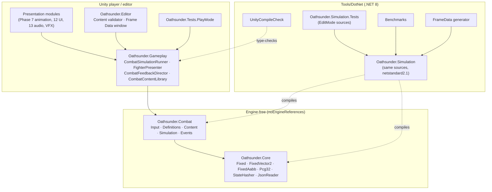
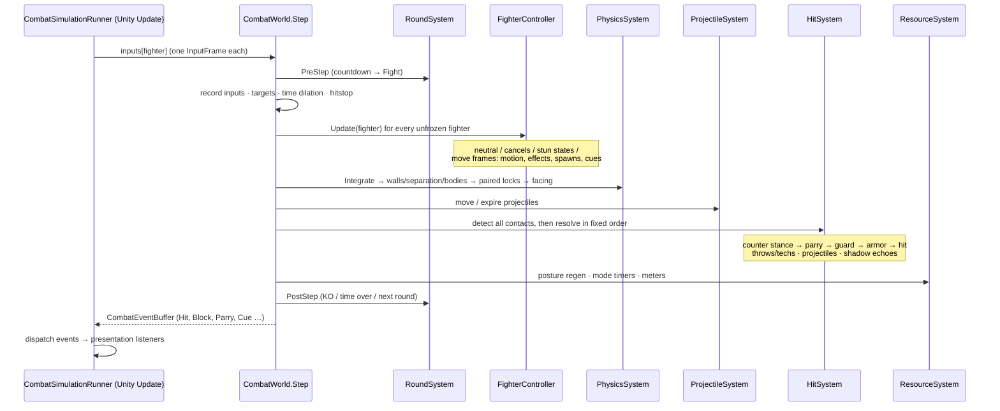
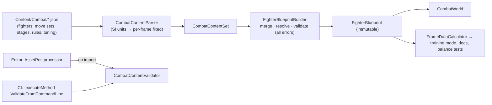

# Phase 3 — Technical Architecture

> Engine: **Unity 6 LTS** (6000.0.x) · Render pipeline: **URP** · Language: **C# 9** (`netstandard2.1` API surface)
> Canon: [`00-Canon.md`](00-Canon.md) · Structure: [`04-ProjectStructure.md`](04-ProjectStructure.md) · Combat: [`05-CoreCombat.md`](05-CoreCombat.md)

---

## 1. Architectural principles

| Principle | Concrete rule in this codebase |
|---|---|
| **Deterministic core, disposable presentation** | All gameplay-relevant state lives in engine-free assemblies (`Oathsunder.Core`, `Oathsunder.Combat`) with `noEngineReferences: true`. Unity code only *reads* simulation state and *feeds* input. |
| **Clean Architecture** | Dependencies point inward: Presentation → Gameplay (Unity bridge) → Combat (domain) → Core (math, serialisation). The domain never references Unity, and CI proves it by compiling it with the plain .NET SDK. |
| **SOLID** | Each simulation system owns one concern (`FighterController`, `PhysicsSystem`, `HitSystem`, `ProjectileSystem`, `ResourceSystem`, `RoundSystem`); input comes through `ICombatInputSource`, output through events; content is open for extension through data, closed for modification in code. |
| **Dependency injection** | Pure C# uses constructor injection (`CombatWorld` builds its systems from a `CombatSetup`). Unity uses a scene composition root: serialized references to ScriptableObject configs and explicit `SetInputSource` / `AddListener` calls. **No global singletons or service locators in the simulation.** |
| **Event-driven** | The simulation emits `CombatEvent`s into a fixed buffer each tick; presentation, UI, audio, achievements and telemetry subscribe. Nothing in presentation can alter simulation state. |
| **Data-driven** | Moves, fighters, stages, rules and tuning are JSON (frame-exact, diffable, moddable, testable). Presentation mappings (cues → VFX/SFX) are ScriptableObjects. Heavy assets load through Addressables. |
| **Zero allocation per tick** | Preallocated fixed-capacity state; value-type fighter/projectile state; no LINQ, closures, boxing or strings in the hot path. Asserted by `DeterminismTests.SteppingDoesNotAllocate`. |

## 2. Layer and assembly map



| Assembly | Folder | Engine refs | Depends on | Purpose |
|---|---|---|---|---|
| `Oathsunder.Core` | `Runtime/Core` | none | — | Deterministic math, RNG, hashing, JSON |
| `Oathsunder.Combat` | `Runtime/Combat` | none | Core | Fighting simulation and content model |
| `Oathsunder.Gameplay` | `Runtime/Gameplay` | Unity | Core, Combat | Unity bridge: tick loop, presentation, cues |
| `Oathsunder.Editor` | `Editor` | Unity Editor | Core, Combat, Gameplay | Validation, designer windows |
| `Oathsunder.Tests.EditMode` | `Tests/EditMode` | Test runner | Core, Combat | Unit, integration, gameplay, determinism tests |
| `Oathsunder.Tests.PlayMode` | `Tests/PlayMode` | Test runner | Core, Combat, Gameplay | Runtime integration tests |

Future phases add assemblies at the same level as `Oathsunder.Gameplay`
(`Oathsunder.AI`, `Oathsunder.RPG`, `Oathsunder.Netcode`, `Oathsunder.UI`, `Oathsunder.Audio`), each engine-free
where the logic is gameplay-relevant (AI decisions, RPG stat maths, rollback session) and Unity-bound only for
presentation and platform services.

## 3. The deterministic simulation contract

**Given the same `CombatSetup` and the same per-frame inputs, every `Step` produces bit-identical state on every
platform.** Everything else (rollback netcode, replays, server-side anti-cheat verification, spectating,
training-mode recordings, automated balance runs) is built on that one sentence.

| Rule | Why | Enforcement |
|---|---|---|
| Q47.16 fixed point everywhere (`Fixed`) | IEEE floats differ across CPUs/compilers/IL2CPP | `Oathsunder.Combat` has no `float`/`double` in simulation paths; content numbers parse from decimal text straight to fixed |
| Odd-symmetric rounding (`(-a)·b == -(a·b)`) | Left side and right side must behave identically | `FixedTests.MultiplicationAndDivisionAreOddSymmetric`, `DeterminismTests.MirroredMatchIsAnExactMirrorImage` (6,000 fuzzed frames) |
| Fixed iteration order, no hash-map iteration | Unordered iteration is non-deterministic | Arrays indexed by fighter/slot; dictionaries only at load time |
| Cross-fighter reads use a pre-logic snapshot | Player 1 must not see player 2's *current-frame* decision | `CombatContext.PreLogic` |
| All randomness from the seeded `Pcg32` in state | Replays and rollback | RNG is part of `CombatWorldState` and the checksum |
| Complete, cheap snapshots | Rollback | `CombatWorldState.CopyFrom` — array copies, no allocation |
| Checksum of everything | Desync detection | `CombatWorldState.ComputeChecksum`; `DeterminismTests.RollbackAndResimulationIsBitExact` |

### 3.1 Tick pipeline



### 3.2 Time model

- Simulation: **60 ticks/s**, fixed. Rendering: variable (60–240 FPS), interpolated with `CombatSimulationRunner.Alpha`.
- **Hitstop** and **time dilation** (Shadow Time) are simulated per fighter via *local frames*. The input buffer
  ages in local frames, so presses during hitstop stay valid.
- Unity's `Time.timeScale` never affects the simulation. Offline cinematic slow motion uses
  `CombatSimulationRunner.TickRateScale`; networked sessions keep it at 1.

## 4. Rollback netcode architecture (implemented in Phase 14, enabled by Phase 5)

```mermaid
flowchart LR
    Local["Local input<br/>(ICombatInputSource)"] --> Queue["Input queue<br/>(delay 1–2 frames)"]
    Queue --> Session
    Net["Remote inputs<br/>(UDP, redundant packets)"] --> Session["RollbackSession"]
    Session -->|predict = repeat last input| World["CombatWorld.Step"]
    Session -->|SaveState every frame| Ring["Snapshot ring (8–10 frames)<br/>CombatWorldState[]"]
    Net -->|mismatch at frame F| Session
    Session -->|LoadState(F) + re-simulate to now| World
    World -->|checksum every N frames| Sync["Desync detector"]
    World --> Events["Events + dedupe by<br/>(frame, type, actor, target, instance)"]
```

Phase 5 already satisfies the requirements a rollback session needs: bit-exact snapshots, 8-frame
re-simulation costing **10.7 µs mean on a 2.1 GHz Xeon** (see §8), stable event keys, and inputs packed into
15 bits (`InputFrame.Pack`).

## 5. Data pipeline



- Designers write **SI units** (m, m/s, m/s²) and **1-based frames**; the parser converts exactly to per-frame
  fixed values with `decimal` arithmetic (no float rounding).
- Every validation problem is reported at once with its JSON path, e.g.
  `$.moves[3].hitboxes[0]: hitbox window 8-12 is outside 1..10`.
- Parsed move sets are never mutated; each blueprint resolves its own clones, so one parsed universal set can
  be merged into every fighter.

## 6. Unity integration

| Concern | Component | Notes |
|---|---|---|
| Fixed tick + interpolation | `CombatSimulationRunner` | Accumulator with a 4-tick catch-up cap; unscaled time |
| Input | `ICombatInputSource` | Player (Phase 6), AI (Phase 8), network (Phase 14), replay/recording (`RecordedInputSource`) all feed the same interface |
| Rendering a fighter | `FighterPresenter` | Interpolated transform; **frame-locked Animator** (`speed = 0`, `Play(state, 0, t)` + `Update(0)` each frame) so poses are a pure function of simulation state |
| Game feel | `CombatFeedbackDirector` + `CombatCueLibrary` | Data cues and synthesised impact cues → pooled VFX, sounds, camera shake, haptics |
| Debug | `CombatDebugDrawer` | Hurt/hit/push boxes and projectiles as gizmos; basis of training-mode overlay |
| Content | `CombatContentLibrary`, `CombatMatchConfig` | ScriptableObjects referencing JSON TextAssets; composition root for a match |

## 7. Cross-cutting systems (designed now, implemented in their phases)

| System | Architecture | Phase |
|---|---|---|
| Save data | Versioned JSON save documents with migration steps; saved by an engine-free `SaveModel` and written through a platform `ISaveStorage` (local file, iCloud/Play Games, Steam Cloud). Checksummed against tampering. | 10 |
| RPG → combat | RPG layer computes a `CombatStats` struct per fighter per match; the simulation only multiplies permille values. Ranked forces `CombatStats.Normalized`. | 10 |
| AI | Behaviour trees + utility scoring produce **inputs**, never state changes; player-pattern analysis reads combat events. Deterministic when seeded, so AI fights replay exactly. | 8 |
| Networking | Rollback session (engine-free), transport adapter (UDP relay with NAT punch-through), matchmaking/ranked/clan services behind REST + WebSocket. | 14 |
| Anti-cheat | Server re-simulates ranked matches from the input log (deterministic) and compares checksums; client integrity checks are defence-in-depth only. | 14 |
| Telemetry | Event-sourced: combat events + meta events batched to an analytics endpoint; privacy-first, opt-in where required. | 12/16 |
| Localisation | Unity Localization string tables; content ids stay stable, display names are keys. | 12 |
| Addressables | Groups per region (arena scenes, enemies, music), per weapon class (animations, VFX, SFX) and per cosmetic bundle; remote catalogs for live-ops. | 15 |

## 8. Performance architecture and budgets

### 8.1 Measured (Phase 5)

Release build, .NET 8, Intel Xeon @ 2.1 GHz, fuzzed inputs, 200,000 measured frames per scenario
(`Tools/DotNet/Oathsunder.Tools.Benchmarks`):

| Scenario | Mean | p99 | Allocation |
|---|---:|---:|---:|
| 1v1 simulation step | 3.26 µs | 14.53 µs | 0 B |
| 2v2 simulation step | 2.57 µs | 6.47 µs | 0 B |
| 1v1 step + full-state checksum | 4.90 µs | 12.08 µs | 0 B |
| 1v1 8-frame rollback (restore + 8 re-simulations + save) | 10.74 µs | 29.67 µs | 0 B |

Even assuming mobile IL2CPP is 10× slower, a worst-case 8-frame rollback costs ≈ 0.3 ms at p99: under 4 % of
an 8.3 ms (120 FPS) frame.

### 8.2 Frame budgets per tier

| Tier | Target | CPU main thread | Render thread | GPU | Memory |
|---|---|---:|---:|---:|---:|
| Android low-end | 60 FPS | 9 ms | 5 ms | 14 ms | 1.4 GB |
| Android mid / iOS | 90 FPS | 6.5 ms | 4 ms | 10 ms | 2.0 GB |
| Flagship mobile | 120 FPS | 5 ms | 3 ms | 7.5 ms | 2.5 GB |
| PC Ultra | 240 FPS | 2.5 ms | 1.5 ms | 3.8 ms | 6 GB |

Simulation share of the main-thread budget: ≤ 0.2 ms (≤ 0.6 ms during an 8-frame rollback on low-end).

### 8.3 Where Burst, Jobs and DOTS are used

| Workload | Technology | Why |
|---|---|---|
| Combat simulation | Managed C#, single-threaded, fixed-point | Tiny cost (µs), strict determinism; Burst float maths is not cross-platform deterministic |
| Crowd/ambient life, destructible debris, foliage interaction | Entities + Burst + Jobs | Thousands of cheap agents, presentation-only |
| VFX simulation | VFX Graph (PC/flagship) / Shuriken GPU-light (low-end) | Scales per tier |
| IK solving, cloth and hair secondary motion | Animation Rigging + Burst jobs | Parallel, presentation-only |
| AI perception queries (multi-enemy gauntlets) | Burst jobs over NativeArrays, results fed back as *inputs* | Keeps AI deterministic |

## 9. Coding standards (enforced)

- Naming per canon §9; `_camelCase` private fields; one public type per file for MonoBehaviours/ScriptableObjects.
- `TreatWarningsAsErrors` + warning level 5 in the .NET build of the simulation.
- XML documentation on every public type and member of the engine-free assemblies.
- No `float`/`double`, `System.Random`, `DateTime`, `Dictionary` iteration, LINQ or allocation in `Simulation/`.
- Tests use only NUnit 3 APIs available in Unity's bundled NUnit, so one test source runs in both runners.

## 10. Testing and CI

| Layer | What | Where |
|---|---|---|
| Unit | Fixed maths, JSON, RNG, hashing, input buffer, motions, validation | `Tests/EditMode/Core`, `Tests/EditMode/Combat/InputTests.cs`, `ContentTests.cs` |
| Integration / gameplay | Every mechanic frame-by-frame through `CombatHarness` | `Tests/EditMode/Combat/*Tests.cs` |
| Determinism | Fuzz replay, rollback sync-test, mirror symmetry, event stability, zero allocation | `DeterminismTests.cs` |
| Runtime | Unity tick loop, listeners | `Tests/PlayMode` |
| Performance | Benchmarks with regression output | `Tools/DotNet/Oathsunder.Tools.Benchmarks` |
| Content | Every JSON and fighter × weapon combination | `CombatContentValidator` (editor + batch mode), `ContentTests` |

CI (`.github/workflows/oathsunder-simulation.yml`) builds the solution with warnings as errors, runs the
144-test suite, and publishes the generated frame-data report and benchmark table as artifacts on every push
touching `games/Oathsunder/**`. The Unity job (EditMode + PlayMode + content validation in batch mode) is
added in Phase 16, once the build machine has a Unity licence secret.

## 11. Phase 3 deliverables and next-phase dependencies

| Deliverable | Status |
|---|---|
| Layered architecture and assembly map | This document §2; asmdefs under `Assets/_Project` |
| Determinism contract | §3, implemented and tested in Phase 5 |
| Rollback architecture | §4 design; prerequisites implemented |
| Data pipeline | §5, implemented |
| Unity integration | §6, implemented |
| Performance budgets | §8, with Phase 5 measurements |

**Next dependencies:** Phase 6 (player controller) implements `ICombatInputSource` for touch/pad/keyboard on
the Unity Input System and the camera rig; Phase 7 replaces the Animator path in `FighterPresenter` with the
Playables graph while keeping frame locking.
