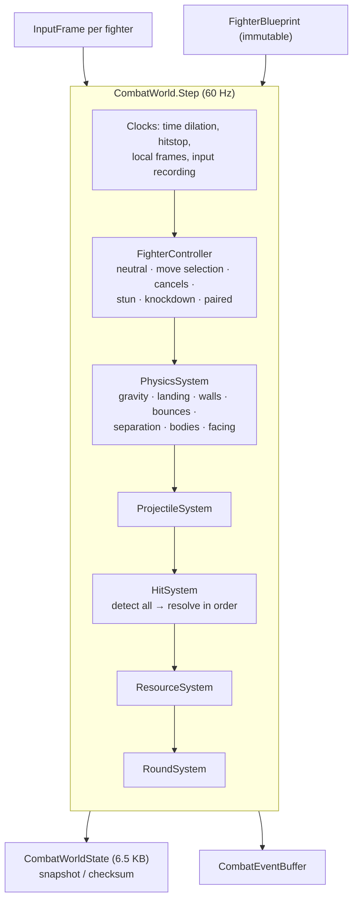
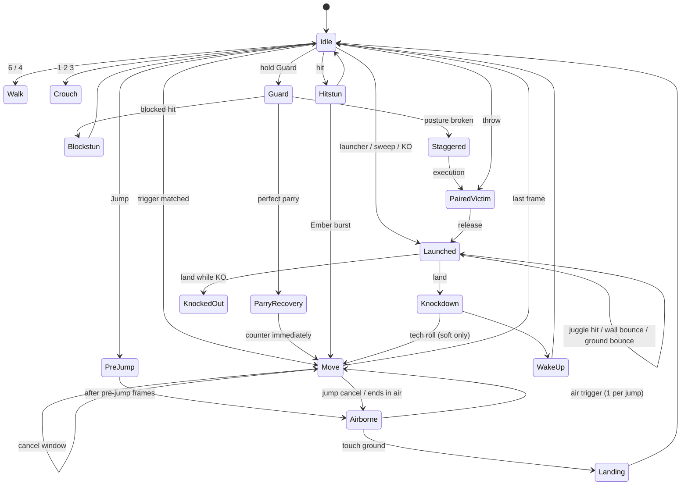

# Phase 5 — Core Combat Framework

> Status: **implemented and validated.** 144 automated tests pass in the .NET runner (the same sources run in
> Unity's Test Runner). Generated data: [`05-CoreCombat/Generated-FrameData.md`](05-CoreCombat/Generated-FrameData.md).
> Architecture: [`03-TechnicalArchitecture.md`](03-TechnicalArchitecture.md) · Design intent: [`02-GameDesign/01-Combat.md`](02-GameDesign/01-Combat.md)

---

## 1. Scope

| Mechanic (brief) | Implemented as | Validated by |
|---|---|---|
| Frame-perfect input | Input recorded and acted on in the same tick (0 added frames); 60 Hz fixed tick | `StrikeTests.LightStartsOnThePressFrameAndHitsOnFrameSix` |
| Input buffering | 8 fighter-local frames; paused by hitstop; FIFO consumption keeps press order | `InputTests.*Buffer*`, `StrikeTests.EarliestBufferedPressWins` |
| Animation cancel windows | `cancels[]` with hit/block/contact/whiff/evade conditions, tag targets, held/released/auto transitions | `LightStringChains…`, `HoldingHeavyCharges…`, `DashCancelsIntoAttacks` |
| Hit stop | Per-fighter freeze in local frames (projectiles never freeze the thrower) | `HitstopFreezesBothFighters`, `SeveringWindTravelsAndHits` |
| Hit stun / block stun | N full frames, act on N+1; measured advantage equals frame data | `MeasuredFrameAdvantageMatchesFrameData`, `BlockAdvantageMatchesFrameData` |
| Perfect parry | Guard press ≤ 6 frames before contact; 2 frames when mashing; posture punishment; cancels denied | `PerfectParry…`, `ParryDeniesTheAttackersCancel`, `MashingGuardShrinksTheParryWindow` |
| Perfect dodge | Dodge perfect window → Shadow Time (attacker slowed) + meter; the dodged attack is spent; riposte cancel | `PerfectDodgeTriggersShadowTime`, `PerfectDodgeOpensARiposteCancel` |
| Dash / roll / backstep | Universal data moves; strike invulnerability; rolls pass through bodies | `MovementTests.*` |
| Air combos / launchers | Launch flag, jump cancel, air strings, juggle points, gravity scaling | `LauncherAirComboRouteConnects`, `JuggleLimitMakesFurtherHitsWhiff` |
| Wall bounce / ground bounce | Pending bounce flags, once per combo each | `OathsealWallBouncesOncePerCombo`, air route test |
| Counter attacks | Counter hits and punishes, counter stance (Stillwater) | `CounterHitAddsDamageAndHitstun`, `PunishingRecoveryIsFlagged`, `StillwaterCountersAStrike` |
| Grabs / throws | Grab hitboxes, paired actions, tech window, throw invulnerability, throw clash | `ThrowTests.*` |
| Executions / finishers | Guard break or low-health stagger → Execute → cinematic paired action; finisher flag on KO | `GuardBreakOpensAnExecution`, `ExecutionKillIsAFinisher` |
| Slow-motion cinematic kills | `KnockOut` event with `Finisher` flag + `RoundEnding` hold; offline tick-rate scaling in the runner | `RoundTests.*` |
| Rage mode | Ember Rage: +20 % damage, heavy armor, burst from hitstun (rule-controlled) | `EmberRageBoostsDamage`, `RageBurstBreaksACombo`, `RageBurstCanBeDisabledByRules` |
| Shadow mode | Umbral Shadow: delayed 30 % echo of every hit | `UmbralShadowEchoesEveryHit` |
| Ultimate abilities | Meter-gated invincible starter → cinematic paired sequence with unscaled damage | `UltimateCinematicDealsScriptedDamage`, `UltimateIsInvincibleOnStartup` |
| Rollback-ready determinism | Fixed point, snapshots, checksums | `DeterminismTests.*` |

## 2. System architecture

### 2.1 Fighter state machine

## 3. Frame conventions

| Term | Definition |
|---|---|
| Move frame | 1-based. The press frame is move frame 1 (no added latency). |
| Startup *N* | First active hitbox on move frame *N*. |
| Recovery | `TotalFrames − LastActiveFrame`; the fighter acts on frame `TotalFrames + 1`. |
| Hitstun / blockstun *N* | *N* full frames of stun after hitstop; the victim acts on frame *N + 1*. |
| Advantage | `stun − (TotalFrames − contactFrame)`; hitstop freezes both fighters equally, so it cancels out. |
| Local frame | A fighter's own frame counter. It advances only while that fighter simulates, not during hitstop or skipped time-dilated ticks. The input buffer and parry windows use local frames. |

## 4. Input

- **Logical buttons:** `Light, Heavy, Special, Guard, Dodge, Jump, Grab, Execute, Ultimate, Rage, Shadow`
  (11 bits) plus absolute stick X/Y (2 bits each) → 15-bit packed `InputFrame`.
- **Directions** are converted to numpad notation relative to the fighter's *current* facing by the simulation,
  so side switches never corrupt input.
- **Buffer:** a press is usable for 8 local frames. Consumption is a high-water mark: starting a move from a
  press on world frame *F* consumes every press ≤ *F*, keeping newer presses buffered.
- **Selection rule:** among all triggers satisfied this frame (from neutral or from open cancel windows), the
  one completed on the **earliest press frame** wins; ties go to the higher `priority`, then to declaration
  order. So *L then H* performs L2 then the launcher, while 6L beats L and 623S beats 236S on the same press.
- **Motions:** `236`, `214`, `623` (accepts the `323` shortcut), `66`, `44`, with per-step and total windows.
  Between the final motion direction and the button only neutral is accepted, so walking forward into a
  quarter-circle never produces a dragon motion.
- **Schemes:** Classic uses motions; Simplified uses direction + Special (`6S`, `4S`, `8S`). Special moves
  performed with a Simplified-only trigger start 2 frames later (`simplifiedStartupPenalty`), which keeps
  ranked fair without reducing damage.
- **Chords:** a trigger with several buttons completes when all were pressed within 3 frames.

## 5. Content schema reference

Units: metres, m/s, m/s²; frames 1-based inclusive; `[x, y]` vectors are facing-relative (+X = forward).
Boxes are `{ "x", "y", "w", "h" }` with the minimum corner relative to the fighter's feet.

### 5.1 Move

| Field | Type | Meaning |
|---|---|---|
| `id` / `name` | string | Stable id (`katana.l1`) / display name |
| `tags` | MoveTags[] | `Normal, Command, Special, Ultimate, Throw, Execution, Movement, Light, Heavy, Charged, Air, Launcher, Counter, Projectile, ModeActivation, Evasive, Cinematic, Low, Overhead` |
| `flags` | MoveFlags[] | `ChainOnly, LandCancel, KeepMomentum, EndsCrouched, NoAutoFace, CrouchingHurtbox, PassThrough` |
| `frames`, `landingRecovery` | int | Total frames; recovery when a land-cancel move lands |
| `animation` | string | Animation clip / state key |
| `triggers[]` | Trigger | See 5.2 |
| `attacks{}` | Attack by key | See 5.3 |
| `hitboxes[]` | `{frames, box, attack, group}` | Group 0–7; each group hits each victim once per move instance |
| `hurtboxes[]` | `{frames, boxes[], replace}` | Extra (or replacement) hurtboxes |
| `invulnerable[]` | `{frames, against: [Strike, Throw, Projectile]}` | Invulnerability |
| `armor[]` | `{frames, hits, damagePermille}` | Absorb hits without stun |
| `cancels[]` | Cancel | See 5.4 |
| `motion[]` | `{frames, velocity | velocityX | velocityY, gravity}` | Scripted root motion (m/s) and gravity multiplier |
| `spawn[]` | `{frame, projectile, offset}` | Projectile spawns |
| `effects[]` | `{frame, effect}` | `ActivateRage`, `ActivateShadow`, `FaceTarget` |
| `cues[]` | `{frame, name}` | Presentation cues (VFX, SFX, camera, haptics) |
| `counter` | `{frames, catches, move}` | Counter stance |
| `paired` | Paired | See 5.5 |
| `perfectEvade` | `[start, end]` | Perfect-dodge window |
| `cost` | `{rage, shadow, ultimate}` | Paid when the move starts |

### 5.2 Trigger

| Field | Meaning |
|---|---|
| `buttons` | Chord of logical buttons (omit for motion-only triggers such as `66`) |
| `direction` | Numpad set on the press frame: digits (`"369"`) or `any, down, up, forward, back, notdown, neutral` |
| `motion` | `236`, `214`, `623`, `66`, `44` |
| `stance` | `Grounded`, `Airborne`, `Stunned` (bursts) |
| `schemes` | `Classic`, `Simplified` |
| `conditions` | `TargetExecutable`, `RageActive`, `RageInactive`, `ShadowActive`, `ShadowInactive` |
| `priority` | Tie-break between triggers completed on the same press |

### 5.3 Attack

| Field | Meaning |
|---|---|
| `damage`, `chip`, `posture` | Base damage, chip damage on block, posture damage (½ on hit, ×1.5 on parry) |
| `hitstun`, `blockstun`, `hitstop` | Frames |
| `height` | `High, Mid, Low, Overhead, Unblockable` |
| `flags` | `Launch, Knockdown, HardKnockdown, WallBounce, GroundBounce, GuardCrush, Unparryable, Grab, AirGrab, Execution, OffTheGround, LaunchOnCounter, StaggerOnParry, ArmorBreak, IgnoreJuggleLimit, Finisher, ChipKills, Spike` |
| `element` | `Physical, Ember, Umbra, Frost, Storm, Venom, Radiant` (RPG resistances in Phase 10) |
| `knockback`, `pushback` | m/s on hit / on block |
| `launch`, `airKnockback` | `[x, y]` m/s |
| `juggleCost`, `proration` | Juggle points; starter proration (permille) |
| `onHit` | Move the attacker switches to on hit (throw success, ultimate cinematic, execution) |

### 5.4 Cancel window

| Field | Meaning |
|---|---|
| `frames` | Open frames |
| `on` | `always, hit, block, contact, whiff, evade` |
| `input` | `Trigger` (targets' triggers), `Held`/`Released` + `button` (charge), `Auto` |
| `to[]`, `tags[]` | Explicit targets and/or any non-chain-only move with the tags |
| `jump` | Allow a jump cancel |

### 5.5 Paired action (throws, executions, ultimates)

`victimOffset`, `techWindow` (0 = untechable), `hits[]` (`frame`, `damage`, `posture`, `unscaled`),
`releaseFrame`, `releaseAttack` (reaction on release), `turnAround` + `releaseOffset` (back throws),
`cinematic`, `victimAnimation`.

### 5.6 Fighter, stage, rules, tuning

- **Fighter:** health, posture, walk speeds, jump (pre-jump frames, velocities, gravity, fall speed), friction,
  landing/knockdown/wake-up frames, knockback weight, stance boxes (standing, crouching, airborne, knockdown).
- **Stage:** walls, maximum camera separation, spawn offset, wall bounce enabled.
- **Rules:** rounds to win, timer, countdown, KO hold, Shadow Time scale and duration, executions, Ember burst,
  RPG stats (false in ranked), meter carry-over, friendly fire.
- **Tuning:** every mechanics constant (see `tuning.combat.json`; the code defaults must match it —
  `ContentTests.ShippedTuningMatchesCodeDefaults`).

## 6. Mechanics — implementation notes

| Mechanic | Rule |
|---|---|
| Guard | Holding Guard in neutral → standing (blocks high/mid/overhead) or crouching (`Guard`+down: blocks high/mid/low). Blockstun keeps guarding and can switch height. Chip cannot kill unless `ChipKills`. |
| Perfect Parry | Opening the window needs a fresh press in a parry-capable state (neutral, guard, blockstun, parry recovery). Window 6 local frames; a press within 20 frames of the previous one gets 2. Success: both freeze ≥ 10 frames, parrier is actionable, attacker takes 1.5× posture damage and cannot cancel; `StaggerOnParry` attacks stagger 30 frames. Each parry closes the window (multi-hit attacks need one parry per hit) and resets the mash timer. |
| Perfect Dodge | An attack overlapping a dodge's hurtbox during its perfect window while the dodge is invulnerable: Shadow Time (attacker ticks at `perfectDodgeTimeScale`, 0.35 story / 0.5 ranked), +200 Shadow, the dodged move instance can no longer hit the dodger, and the dodge may cancel into attacks (`on: evade`). |
| Posture | Block adds full posture damage, hit adds half (never breaks by hits), parry adds 1.5× to the attacker. At max: Guard Break → Staggered 80 frames, executable. Regenerates 3/frame after 90 frames without posture damage. |
| Counter hit / punish | Hit during an attack's startup or active frames: ×1.2 damage, +4 hitstun, +2 hitstop, `LaunchOnCounter` launches. Hit during recovery or landing: ×1.1 damage, +2 hitstun. |
| Combo scaling | Starter hit deals 100 %. Hit *n* ≥ 2 deals `max(30 %, perHit(n) × starterProration)` where `perHit` is 100 % for hits 1–2, then −10 % per hit. Example: L1→L2→L3→L4 = 40 + 36 + 39 + 57 = **172**. |
| Hitstun decay | From the 7th hit, −1 frame of hitstun every 2 hits (minimum 6). |
| Juggles | Juggle points (budget 8) plus +4 % gravity per combo hit (cap 180 %). Hits that would exceed the budget whiff. |
| Bounces | `WallBounce` / `GroundBounce` set a pending bounce consumed on contact, once per combo each. `Spike` knocks down airborne victims only. |
| Throws | 5-frame grab boxes; cannot grab victims in hit/blockstun, launched, knocked down, waking up, staggered, or within 4 frames after stun. Tech: press Grab within 8 frames of the connect → both pushed apart. Simultaneous throws tech automatically. Back throws turn the thrower around. |
| Counter stance | Strikes or projectiles landing in the stance window are nullified and answered with the counter move (which may itself counter-hit). |
| Armor | Absorbs a number of hits per move instance at reduced damage with a short hitstop. Ember Rage gives Heavy moves one armored hit during startup/active. |
| Projectiles | Pooled (16), clash with opposing projectiles (durability), can be parried, perfectly dodged or caught by counter stances; never freeze the thrower. |
| Ember Rage | Full Rage meter: 8 s, ×1.2 damage, heavy armor; activation is invulnerable and blasts nearby opponents; usable from hitstun as a combo breaker when `rageBurst` is on. |
| Umbral Shadow | Full Shadow meter: 6 s, every hit schedules an echo 10 frames later for 30 % damage (+3 hitstun if still stunned). |
| Ultimate | Full Ultimate meter: invincible startup; on hit becomes an untechable cinematic paired action with unscaled damage. |
| Execution | Target guard-broken, or ≤ 15 % health while staggered or in hitstun, within 1.8 m: Execute grabs (ignores throw protection) into a cinematic paired action. A lethal execution or ultimate is a **Finisher**. |
| Knockdown | Soft 32 frames (tech-roll with Dodge in the first 10), hard 55 frames; wake-up 22 frames fully invulnerable. Only `OffTheGround` attacks hit a downed fighter, once per combo. |
| Corner | A victim in hit/blockstun pinned against a wall transfers its pushback to the attacker. |
| Rounds | Countdown → fight → KO/time-over → hold (finisher slow motion) → next round or match over. Double KO is a draw; stepping after match over is harmless. |

## 7. The Katana (Oathblade Style)

Full data: `Content/Combat/MoveSets/moveset.katana.json`; frame data, animation spec and cue list:
[`05-CoreCombat/Generated-FrameData.md`](05-CoreCombat/Generated-FrameData.md).

| Route (validated by tests) | Notation | Damage |
|---|---|---|
| Light string | `L, L, L, L` → wall bounce | 172 |
| Launcher air combo | `L, L, H` → jump cancel → `j.L, j.L, j.H` → ground bounce | 6 hits, > 200 |
| Parry counter | Perfect Parry → any move on frame 1 of parry recovery | — |
| Riposte | Perfect Dodge → `L` from dodge frame 8 | — |
| Charge | Hold `H` ≥ 30 frames → *Full Moon* guard crush → Execute | 160 + 300 |

## 8. Events

`CombatEvent` = (frame, type, actor, target, instance, value, value2, position, flags). The tuple
(frame, type, actor, target, instance) is stable under rollback re-simulation (`ResimulatedEventsMatch`).
Types: `RoundStart, RoundFight, MoveStart, Cue, Jump, Land, Hit, Block, Parry, PerfectDodge, CounterStance,
ArmorHit, GuardBreak, Launch, WallBounce, GroundBounce, Knockdown, TechRoll, WakeUp, ComboEnd, GrabConnect,
ThrowTech, PairedHit, PairedRelease, ExecutionStart, UltimateCinematic, ProjectileSpawn, ProjectileClash,
ProjectileEnd, RageStart, RageEnd, ShadowStart, ShadowEnd, ShadowEcho, TimeDilationStart, KnockOut, TimeOver,
RoundEnd, MatchEnd`. Flags: `Counter, Punish, Lethal, Finisher, Projectile, Low, Overhead, Juggle, Heavy, Rage`.

## 9. Unity setup (combat test scene)

1. Create `DA_CombatContentLibrary` (Create → Oathsunder → Combat → Content Library), then run
   **Oathsunder → Combat → Sync Content Libraries**.
2. Create `DA_Match_Test` (Match Config): stage `stage.training.dojo`, rules `rules.training`, two
   `fighter.rhen` + `weapon.katana` slots on teams 0 and 1.
3. Scene: an empty `CombatRunner` object with `CombatSimulationRunner` (library + match),
   `CombatDebugDrawer`, and `CombatFeedbackDirector` (cue library, camera rig, audio source).
4. Two fighter prefabs with `FighterPresenter` (runner, index 0/1, Animator whose states are named after the
   `animation` keys and `A_Fighter_<Action>`).
5. Phase 6 assigns the player's `ICombatInputSource`; until then use `RecordedInputSource` or the tests.

## 10. Testing plan and results

| Fixture | Tests | Covers |
|---|---:|---|
| `Core/FixedTests` | 18 | parsing, rounding, odd symmetry, sqrt, boxes |
| `Core/JsonReaderTests` | 12 | all value kinds, errors with line/column/path |
| `Core/RandomAndHashTests` | 4 | PCG32 reproducibility, bias, hashing |
| `Combat/InputTests` | 11 | packing, facing, buffer window, hitstop freeze, consumption order, chords, ring wrap |
| `Combat/MotionCommandTests` | 13 | 236/214/623/66/44, shortcuts, leniency, walking-into-motion, motion floor |
| `Combat/ContentTests` | 9 | all files parse, validation, units, frame data, blueprint isolation |
| `Combat/MovementTests` | 11 | walk, jump arc, bodies, walls, separation, cross-up, dash, backstep, roll |
| `Combat/StrikeTests` | 11 | startup, hitstop, whiff recovery, advantage, chains, press order, counter, punish, trades, hit groups |
| `Combat/DefenseTests` | 14 | block heights, parry, mash, perfect dodge, riposte, guard break, execution, chip, posture |
| `Combat/ThrowTests` | 6 | throw, tech, tech window, throw invulnerability, back throw, throw clash |
| `Combat/AdvancedCombatTests` | 23 | air combo route, juggle limit, bounces, Rage, burst, Shadow echo, ultimate, counter stance, projectiles, charge, schemes, reversal, tech roll, wake-up |
| `Combat/RoundTests` | 6 | KO, rounds, match over, time over, draw, countdown, finisher |
| `Combat/DeterminismTests` | 6 | 6,000-frame fuzz replay, divergence, rollback sync (depth 1–8, 3,000 frames), event stability, mirror symmetry (6,000 frames), zero allocation |
| **Total** | **144** | **all passing** |

PlayMode (`Tests/PlayMode/CombatRunnerPlayModeTests`) covers the Unity tick loop and listener dispatch and
runs in Unity's Test Runner.

## 11. Performance report

Release, .NET 8, Intel Xeon @ 2.1 GHz (4 cores), 200,000 measured frames per scenario with fuzzed inputs:

| Scenario | Mean | p50 | p99 | Allocation |
|---|---:|---:|---:|---:|
| 1v1 simulation step | 3.26 µs | 2.35 µs | 14.53 µs | 0 B |
| 2v2 simulation step | 2.57 µs | 2.51 µs | 6.47 µs | 0 B |
| 1v1 step + checksum | 4.90 µs | 4.56 µs | 12.08 µs | 0 B |
| 8-frame rollback (restore + 8 steps + save) | 10.74 µs | 10.78 µs | 29.67 µs | 0 B |

Optimisation applied this phase: the move selector computes the set of freshly pressed buttons once per frame
and rejects triggers whose buttons are absent before any per-frame scanning. That took the 1v1 step from
7.74 µs to 3.26 µs and the 8-frame rollback from 66 µs to 10.7 µs. The p99/max tails are dominated by OS
scheduling and JIT tiering on the shared benchmark host, not by simulation work.

### Memory

| Item | Size |
|---|---:|
| `FighterState` | 240 B |
| `ProjectileState` / `EchoHitState` | 80 B / 40 B |
| Full `CombatWorldState` snapshot (4 fighters, 16 projectiles, 16 echoes, input histories) | 6,544 B |
| 10-deep rollback snapshot ring | ≈ 65 KB |
| `CombatEventBuffer` (128 events) | 7,224 B |
| Per-tick allocation | **0 B** |

## 12. Asset specifications

- **Animation clips:** the generated table lists every clip with its exact frame count, active frames and root
  motion distance (authored in place at 60 fps). Paired clips list their victim clip and release frame.
- **Presentation cues:** the generated table lists every cue name and the moves using it; each needs a
  `CombatCueLibrary` entry.
- **Synthesised impact cues** (independent of weapon): `impact.hit.light`, `impact.hit.heavy`,
  `impact.hit.counter`, `impact.block`, `impact.parry`, `impact.perfectdodge`, `impact.guardbreak`,
  `impact.wallbounce`, `impact.groundbounce`, `impact.echo`, `impact.knockout`, `impact.finisher`.

| Impact tier | Hitstop | Camera shake | Haptics | VFX budget (mobile/PC particles) | SFX layers |
|---|---:|---:|---:|---:|---|
| Light | 7–9 | 0.02 m | 0 | 12 / 40 | swing + flesh tick |
| Heavy | 11–14 | 0.06 m | 0.5 | 24 / 90 | swing + body + low thump |
| Counter | +2 | 0.08 m | 0.7 | 24 / 90 + ring | + metallic ring |
| Parry | ≥ 10 | 0.05 m | 0.6 | 20 / 60 white-gold | steel clash + choir sting |
| Finisher | 24 | 0.12 m | 1.0 | 40 / 150 | layered + music duck |

## 13. Bug checklist and edge cases (all covered by tests or explicit guards)

- [x] Trade: both fighters hit on the same frame → both take the hit (contacts store the attack at detection).
- [x] Press during hitstop still chains after hitstop (local-frame buffer).
- [x] Two buffered buttons are performed in press order, not priority order.
- [x] Walking forward into 236 is not read as 623.
- [x] A consumed motion cannot be reused by a second button press.
- [x] Holding a button is not a press; holding Guard does not reopen the parry window.
- [x] Guard pressed one frame before a fast low is a legitimate perfect parry, not a block.
- [x] Slowed attacks cannot hit a dodger after the perfect dodge's invulnerability ends.
- [x] Throwing a stunned or waking fighter fails; teching after the window fails.
- [x] A throw holder that gets hit, staggered or cancels releases the victim; orphaned victims fall free.
- [x] Victims held near a wall push the thrower out instead of clipping into the wall.
- [x] One parsed move set merged into several fighters resolves independently.
- [x] Round resets re-place fighters; stepping after match over is harmless.
- [x] Event, contact and projectile pools never overflow in fuzz runs (asserted).

## 14. Known limitations (planned work, not defects)

| Limitation | Resolution |
|---|---|
| Only Katana and universal move sets are authored | Phase 9 authors the other 12 weapon classes on this framework |
| Air guard and air throws unused by content | Supported by the model (`AirGrab`); design decides in Phase 9 |
| Camera separation limit applies to 1v1 only | Multi-enemy encounters use camera framing (Phase 6) |
| Unity-facing code is type-checked against API stubs outside Unity | Authoritative Unity compile and tests run in the Phase 16 Unity CI job |

## 15. Next-phase dependencies

| Phase | Needs from Phase 5 |
|---|---|
| 6 Player Controller | `ICombatInputSource`, `CombatSimulationRunner`, `CombatMatchConfig` |
| 7 Animation | `FighterPresenter` contract, generated clip spec, paired-action offsets |
| 8 Enemy AI | Inputs-only control, frame data API, combat events for pattern analysis |
| 9 Weapons | JSON schema, validator, frame-data tooling |
| 11 Bosses | Executions (phase transitions), armor, projectiles, `CombatStats` |
| 14 Multiplayer | Snapshots, checksums, packed inputs, stable event keys |
