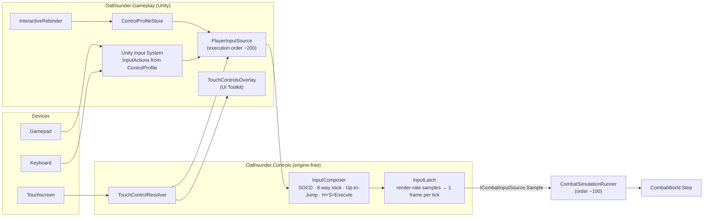

# Phase 6 — Player Controller

> Status: **implemented.** Engine-free input layer validated by 32 new tests (176 total, all passing); Unity
> device, touch-overlay, rebinding and camera code type-checked outside Unity (authoritative Unity compile in
> the Phase 16 CI job). Design intent: [`02-GameDesign/01-Combat.md`](02-GameDesign/01-Combat.md) §3–4.

---

## 1. Scope

In OATHSUNDER the "player controller" is everything between the player's hands and the deterministic
simulation. Movement, jumping, dashing and every action already live in the Phase 5 simulation as data, so the
controller's job is to deliver **exactly the input the player meant, on the earliest possible tick, from any
device**, and to frame the fight with the camera.

| Requirement (brief) | Delivered |
|---|---|
| Touch optimised | Floating stick, slide-press buttons, phone and tablet layouts validated for 16:10–21:9 phones and 4:3 tablets, button scale 0.6–1.8× |
| Controller support | Gamepad bindings through the Unity Input System (any Xbox/PlayStation/Switch Pro/generic HID pad) |
| Keyboard & mouse | Keyboard bindings with SOCD cleaning; mouse excluded from rebinding capture |
| Full input remapping | Every logical button remappable per device, conflict-free by construction, persisted per player slot |
| Frame-perfect input | Presses between ticks are latched; input is sampled before the simulation ticks in the same rendered frame |
| Zero noticeable delay | Device → simulation in the same rendered frame; the simulation acts on the press tick (Phase 5) |
| Camera | 2.5D framing rig: separation zoom, partial air follow, wall-aware clamping, frame-rate-independent damping |

## 2. Input pipeline



### 2.1 Latency budget

| Stage | Cost |
|---|---|
| OS/driver → Input System event queue | Platform dependent (≈ 1–8 ms touch digitiser, ≈ 1 ms USB pad) |
| Input System → `PlayerInputSource.Update` | Same rendered frame (events are processed before `Update`) |
| `PlayerInputSource` → simulation tick | Same rendered frame: order −200 samples, order −100 ticks |
| Simulation → first action frame | 0 frames (the press tick is move frame 1) |
| Tick quantisation | 0–16.7 ms until the next 60 Hz tick boundary (average 8.3 ms) |
| Render → display | 1 display frame (8.3 ms at 120 Hz) + compositor |

**No engine-added frame of delay.** A tap as short as one 240 Hz frame (4.2 ms) still reaches the simulation
(`InputLatchTests.TapShorterThanATickIsNotLost`).

## 3. Engine-free input layer (`Oathsunder.Controls`)

| Component | Behaviour |
|---|---|
| `InputLatch` | Buttons pressed at any sample since the last tick are reported held for that tick; held buttons stay held; a direction tapped and released inside one tick is kept for that tick; with no new samples the last state repeats. |
| `DigitalStick` | Analog → 8-way with a 0.35 deadzone and **cardinal bias** (diagonals 30°, cardinals 60°) so "hold back to guard/walk" never becomes a crouch by accident. |
| `SocdResolver` | Opposite digital directions: *Neutral / Up priority* (tournament default), *Neutral both*, or *Last input wins*. |
| `InputComposer` | Priority: digital directions → touch stick → gamepad stick. Profile conveniences: *Up-to-Jump*, *Heavy + Special = Execute*. |
| `ControlProfile` | Scheme (Classic/Simplified), direction settings, bindings per logical button, touch layout and scale; JSON with a version field; rebinding steals the control from its previous owner so conflicts cannot exist. |
| `TouchLayout` / `TouchControlResolver` | Layouts measured in screen heights (shape preserved on every aspect); floating stick anchored where the thumb lands; buttons hit-tested with 15 % forgiveness; slide-press onto neighbours. |

Everything above runs in **69 ns per rendered frame with zero allocation** (Release, Xeon 2.1 GHz;
`Oathsunder.Tools.Benchmarks`; enforced by `TouchControlTests.InputPipelineDoesNotAllocate`).

## 4. Default bindings

| Logical button | Gamepad (Xbox / PlayStation) | Keyboard | Touch |
|---|---|---|---|
| Light | X / □ | J | L |
| Heavy | Y / △ | K | H |
| Special | B / ○ | L | S |
| Jump | A / ✕ | Space | J |
| Guard | RB / R1 | I | G |
| Dodge | LB / L1 | U | D |
| Grab | LT / L2 | O | T |
| Execute | R3 (and Heavy + Special) | H (and K + L) | X (shown when available) |
| Ultimate | RT / R2 | ; | U |
| Rage | L3 | Q | R |
| Shadow | View / Share | E | Sh |
| Directions | Left stick, D-pad | WASD, arrows | Floating stick |

Defaults: **Classic** on PC and consoles, **Simplified** on mobile (changeable any time; ranked allows both,
with the Phase 5 +2-frame startup cost on Simplified-only Specials).

## 5. Touch layouts

Coordinates are in screen heights from the bottom-right corner (`fromRight`, `y`) with radius `r`.

```
Phone (16:9 shown)                                              ┌───────────── right edge
┌──────────────────────────────────────────────────────────────┐
│                                                   (U)        │
│                                        (R)   (X)             │
│                                   (Sh)                (T)    │
│   ┌───────────── floating stick zone ─────────┐   (S)        │
│   │ (0.80 h wide × 0.75 h tall)               │(J)     (H)   │
│   │                                           │   (L)        │
│   │                                           │(G)      (D)  │
└───┴───────────────────────────────────────────┴──────────────┘
```

| Button | Phone `fromRight, y, r` | Tablet `fromRight, y, r` | Diameter at 1080 p (phone) |
|---|---|---|---:|
| Light | 0.36, 0.16, 0.085 | 0.30, 0.14, 0.068 | 184 px |
| Heavy | 0.20, 0.26, 0.085 | 0.16, 0.22, 0.068 | 184 px |
| Special | 0.36, 0.36, 0.075 | 0.30, 0.31, 0.060 | 162 px |
| Guard | 0.52, 0.13, 0.075 | 0.44, 0.11, 0.060 | 162 px |
| Dodge | 0.12, 0.11, 0.070 | 0.10, 0.09, 0.056 | 151 px |
| Jump | 0.52, 0.29, 0.065 | 0.44, 0.25, 0.052 | 140 px |
| Grab | 0.12, 0.43, 0.060 | 0.10, 0.37, 0.048 | 130 px |
| Execute | 0.27, 0.52, 0.060 | 0.23, 0.45, 0.048 | 130 px |
| Ultimate | 0.12, 0.62, 0.060 | 0.10, 0.53, 0.048 | 130 px |
| Rage | 0.46, 0.52, 0.050 | 0.39, 0.45, 0.040 | 108 px |
| Shadow | 0.60, 0.46, 0.050 | 0.51, 0.40, 0.040 | 108 px |

Floating stick: phone throw radius 0.11 h (119 px at 1080 p), tablet 0.09 h. `TouchLayout.Validate` proves no
button overlaps another or the stick zone and none leaves the screen (tested at 16:9, 19.5:9 and 4:3).

## 6. Remapping and persistence

- `InteractiveRebinder.Begin(button, slot, callback)` runs Input System interactive rebinding (Escape cancels;
  mouse movement ignored), then `ControlProfile.Rebind` assigns the control and removes it from any other
  button (the displaced button is reported so the UI can say *"Jump is now unbound on gamepad"*).
- Profiles are stored at `persistentDataPath/controls/controls.p{slot}.json`, written atomically (temp file +
  replace). An unreadable file is copied to `.corrupt` and defaults are used, so a bad file never blocks play.
- Format (version 1):

```json
{"version":1,"scheme":"Simplified","upToJump":false,"socd":"NeutralHorizontalUpPriority",
 "stickDeadzone":0.35,"diagonalSector":30,"executeChord":true,"touchLayout":"touch.phone",
 "touchButtonScale":1,"bindings":{"Light":["<Gamepad>/buttonWest","<Keyboard>/j"], "…": []}}
```

## 7. Combat camera (`CombatCameraRig`)

| Parameter | Default | Effect |
|---|---:|---|
| Near / far distance | 6.5 m / 10.5 m | Zoom from close to far as separation grows to 8 m (the Phase 5 max separation) |
| Look height | 1.25 m | Framing height of the combat plane |
| Air follow | 40 % | Share of the highest fighter's altitude the camera follows (juggles stay in frame without seasickness) |
| Wall margin | 0.75 m | Stage walls stay in view; the camera never shows past them |
| Damping | 9 (position), 5 (zoom) | Exponential, frame-rate independent (`1 − e^(−k·dt)`) |

Camera shake from `CombatFeedbackDirector` is applied to a **child** transform of the rig, and cinematic
sequences (ultimates, executions, boss intros) take over through `CinematicOverride`.

## 8. Unity scene setup (combat test scene)

1. `CombatRunner` (Phase 5 setup) + **PlayerInputSource** (runner, fighter 0, profile slot 0).
2. **UIDocument** with a `PanelSettings` asset (scale mode *Scale With Screen Size*, reference 1920×1080,
   match height) + **TouchControlsOverlay** (source = the PlayerInputSource).
3. **CameraRig** (CombatCameraRig) → child **Camera** (assigned to the rig) → the camera transform is the
   `CombatFeedbackDirector`'s shake target.
4. Optional **InteractiveRebinder** for the remap screen (Phase 12 UI drives it).

## 9. Testing

| Fixture | Tests | Covers |
|---|---:|---|
| `InputLatchTests` | 5 | sub-tick taps, holds, direction taps, newest direction, idle ticks |
| `DirectionFilterTests` | 12 | 8-way quantisation incl. cardinal bias, invalid settings, all SOCD modes |
| `ControlProfileTests` | 7 | defaults complete and conflict-free, JSON round trip, rebind stealing, malformed/newer files, clamping, composer conveniences, device priority |
| `TouchControlTests` | 8 | layout validity on 3 aspect ratios, every button present, floating stick, slide-press, **touch → simulation integration** (touch stick + Special performs Crescent Rush), zero allocation |
| **Phase 6 total** | **32** | Suite total **176**, all passing (Debug and Release) |

Manual/device test plan (Phase 15 device lab): input-lag camera test (240 fps capture, LED on button press
vs first visual frame), touch accuracy heat maps per layout, pad hot-plug, keyboard ghosting (3-key rollover
checks for common chords), rebinding on every device family, accessibility scale extremes.

## 10. Asset specifications

| Asset | Spec |
|---|---|
| Touch button art | Circular, 256 × 256 px source, 9-slice-free; idle 18 % white, held tint ember orange 55 %; label glyphs from the UI icon font; colour-blind variants via USS classes (Phase 12) |
| Stick art | Base ring 256 px, knob 128 px, 12 % / 35 % opacity |
| Button icons | Per logical button, per device family (Xbox, PlayStation, Switch, keyboard key caps), used by prompts and the move list |
| Haptics | Mobile: light tick on parry/perfect dodge, medium on counter hit, strong on finisher (Phase 12 mapping to `CombatCueLibrary.Haptics`) |

## 11. Next-phase dependencies

| Phase | Uses |
|---|---|
| 7 Animation | Camera `CinematicOverride` for paired cinematics; fighter presenter contract unchanged |
| 8 Enemy AI | AI implements the same `ICombatInputSource`, so it is bound by the same latch-free, frame-exact rules |
| 12 UI/UX | Remap screen on `InteractiveRebinder`, settings on `ControlProfile`, overlay styling, input display from `PlayerInputSource.CurrentButtons` |
| 14 Multiplayer | Local input delay/prediction wraps `PlayerInputSource.Sample` inside the rollback session |
